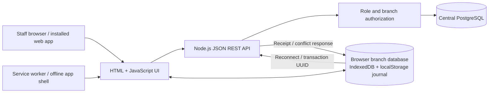

# Shimmery Central architecture

This is a local school-demo implementation of the documented central system. It uses a new project database, fictional records and simulated fingerprint matching. It has not been installed on the corporation's network.

## Central database

`postgres.sql` defines the schema. Product codes and employee/user records are authored centrally. Inventory has one row per branch/product. Sales preserve server-authoritative prices and receipt lines. Purchase orders preserve supplier unit costs. Payroll stores employee names, daily rates and calculation snapshots. Supplier invoices are separate records linked to purchase orders.

The existing local SQLite demo is imported on first initialization only when the public PostgreSQL schema contains no users. Table order respects foreign keys, and serial sequences are reset afterward. This imports the student's earlier demonstration data; it does not import unavailable corporate legacy databases. SQLite source files are preserved.

## Transactions and synchronization

Mutations run in PostgreSQL transactions. An application advisory lock serializes mutation workflows for this small demo, and stock deductions also check that the resulting quantity is nonnegative. This prioritizes correctness at school-demo scale.

Retail sales use a unique transaction UUID. Retrying a saved transaction returns its original receipt and does not deduct stock again. Offline lines include expected prices; changed prices or insufficient central stock produce an explicit conflict. Transfers have retry keys or unique stock-request references. Wholesale fulfillment is tied to one sales record.

## Branch offline implementation

Each browser profile has an IndexedDB branch store for cached catalog snapshots and the pending journal. localStorage provides the synchronous journal used by checkout and a recoverable mirror of branch catalogs. A service worker caches only the application shell; API responses and payroll records are not service-worker cached.

After one online visit and login, the branch POS can reload while the central HTTP server is stopped and record cash sales. Synchronization runs on reconnect and periodically while pending work exists. Central API authorization still applies when the sale syncs. Fresh offline login is unavailable: a previously authorized, unexpired account snapshot is required. Each branch's products must be loaded online before using that branch offline.

This demonstrates branch-local storage and reconnection on one computer. It is not a deployment of five standalone SQL branch servers. The default loopback URL supports service workers; remote-device deployment would need appropriate network access and HTTPS.

## Authorization

Users have role and branch assignments. Sessions use HttpOnly SameSite cookies, and passwords use scrypt hashes. Server-side checks protect every operational endpoint. Money and payroll information are restricted to appropriate roles; packing receives product prices but not supplier costs. Only the owner creates staff accounts. Managers can manage catalog, staff and stock operations. Purchasing maintains suppliers, order quantities and branch reorder levels.

Use separate browser profiles/private windows when presenting different user roles simultaneously; cookies and browser storage are shared between ordinary tabs in the same profile.

## Replenishment

Low stock creates one open proposal per branch/product. Proposed quantities target twice the reorder level, accounting for unreceived purchase-order quantities and pending branch requests. Purchasing can convert a proposal to a pending supplier order or prepare a branch stock request. Supplier orders require management approval before deliveries can be recorded. No supplier message is sent.

## Payroll and wholesale

Attendance uses server time and Asia/Manila business dates. The scan control simulates a match and records time-in/out. Payroll can load completed attendance-day counts for an entered pay period, allow authorized review, and save an immutable calculation snapshot. Overlapping payroll periods for an employee are rejected. Contributions remain explicitly illustrative.

Wholesale quotes store customers, line quantities and negotiated prices separately from retail POS. Management accepts a quote; retail staff or managers fulfill it by recording a cash sale and deducting stock exactly once. Supplier invoice amounts are recorded and compared against ordered purchase costs. These are operational demo records; the app does not execute bank transfers or certify tax invoices.
